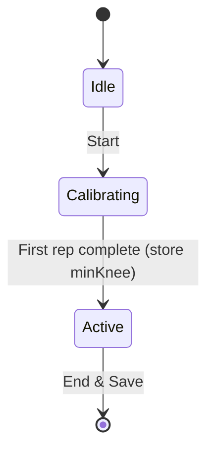

# Personal ROM Calibration

## Current State

- **Depth check**: [formChecks.js](frontend/src/utils/formChecks.js) uses fixed `minDepthKnee: 115` - smaller knee angle = deeper squat
- **Rep detection**: [SquatCam.jsx](frontend/src/components/SquatCam.jsx) `updateRepState` requires `knee <= 115` to register "Bottom" (REP_DETECTION.kneeBottom)
- **Session flow**: Start → reps → End & Save. Session state: `startedAt`, `endedAt`, `reps`, `frames`, `summary`
- **Feedback**: `lastFormFeedback.issues` shows "Go a bit deeper..." when `depthOK` is false

## Design

- **Calibrating**: First rep after Start. Relaxed rep detection (accept shallower squats). On rep complete: store `romCalibration = { minKnee }`, switch to Active.
- **Active**: Normal scoring. Depth check uses `romCalibration.minKnee` when present; feedback shows "You hit X% of your comfortable depth".
- **Depth % formula**: `(kneeTop - rep.minKnee) / (kneeTop - romCalibration.minKnee) * 100` — e.g. 75% = went 75% as deep as calibration.

## Implementation

### 1. Session state and calibration storage

**File**: [SquatCam.jsx](frontend/src/components/SquatCam.jsx)

- Add `sessionPhase`: `"calibrating" | "active"` (or derive from `session.romCalibration`)
- Add `romCalibration: { minKnee: number } | null` to session state
- In `startSession()`: set `sessionPhase = "calibrating"`, `romCalibration = null`

### 2. Relaxed rep detection during calibration

**File**: [SquatCam.jsx](frontend/src/components/SquatCam.jsx)

- In `updateRepState`, when `sessionPhase === "calibrating"`, use relaxed `kneeBottom` (e.g. 150) so a comfortable shallow squat still completes a rep
- Pass `isCalibrating` or read from session state/ref

### 3. Calibration rep handler

**File**: [SquatCam.jsx](frontend/src/components/SquatCam.jsx)

- In `onRepComplete` callback: if `sessionPhase === "calibrating"`, store `romCalibration = { minKnee: repSummary.minKnee }`, set `sessionPhase = "active"`, do NOT count rep or run scoring
- Skip `checkForm`, `scoreRepAgainstRef`, `setAcceptedReps`, etc. for calibration rep
- Show brief UI: "Calibration complete. Your comfortable depth: X°"

### 4. Contextualized depth check and feedback

**File**: [formChecks.js](frontend/src/utils/formChecks.js)

- Extend `checkForm(rep, opts)`: add optional `romCalibration: { minKnee }`
- When `romCalibration` present:
  - Compute `depthPct = (kneeTop - rep.minKnee) / (kneeTop - romCalibration.minKnee) * 100` (clamp 0–100)
  - `depthOK` = `depthPct >= 80` (or configurable threshold)
  - Replace "Go a bit deeper" with "You hit {depthPct}% of your comfortable depth – aim for at least 80%"
- When no `romCalibration`: keep current absolute check (`rep.minKnee <= minDepthKnee`)

**File**: [SquatCam.jsx](frontend/src/components/SquatCam.jsx)

- Pass `romCalibration: session.romCalibration` into `checkForm` when calling

### 5. Positive feedback when depth OK

**File**: [SquatCam.jsx](frontend/src/components/SquatCam.jsx)

- When `lastFormFeedback.overallOK` and `romCalibration` exists, show "You hit {depthPct}% of your comfortable depth" instead of generic "Nice – form looks solid"

**File**: [formChecks.js](frontend/src/utils/formChecks.js)

- Return `depthPct` in the result object when `romCalibration` is used, so UI can display it

### 6. UI for calibration phase

**File**: [SquatCam.jsx](frontend/src/components/SquatCam.jsx)

- In HUD or overlay: when `sessionPhase === "calibrating"`, show "Do one comfortable squat to calibrate"
- After calibration: show "Calibrated: {minKnee}°" or "ROM set" in HUD
- Optional: small banner "Calibration complete – starting rep count"

### 7. Constants

- `kneeTop`: use existing `REP_DETECTION.kneeTop` (168) for depth % formula
- `calibrationKneeBottom`: 150 (relaxed threshold during calibration)
- `depthPctThreshold`: 80 (minimum % of ROM to pass depth check)

## Files to Modify

| File                                                 | Changes                                                                                                                               |
| ---------------------------------------------------- | ------------------------------------------------------------------------------------------------------------------------------------- |
| [SquatCam.jsx](frontend/src/components/SquatCam.jsx) | Session phase, romCalibration state, relaxed rep detection, calibration rep handler, pass romCalibration to checkForm, calibration UI |
| [formChecks.js](frontend/src/utils/formChecks.js)    | Accept romCalibration in opts, compute depthPct, contextualized depth check and messages, return depthPct                             |

## Edge Cases

- **Calibration in front view**: minKnee is available from `computeAnglesFrontView`; repSummary includes it. Use same logic.
- **Very shallow calibration** (e.g. minKnee 160): denominator `kneeTop - minKnee` small; clamp depthPct to avoid extreme values.
- **Session without calibration**: If user somehow skips (e.g. future "Skip" button), fall back to absolute threshold – already handled when `romCalibration` is null.
